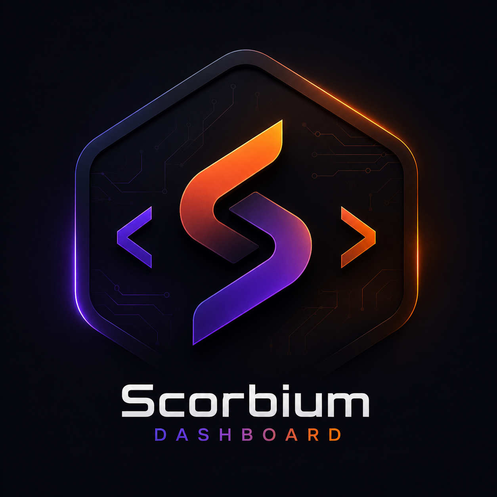

<div align="center">



# Scorbium Dashboard

Платформа для управления VPN-сервисом: FastAPI-панель, пользовательский кабинет, Telegram-бот, платежи и интеграция с VPN-панелью.

[](https://python.org)
[](https://fastapi.tiangolo.com)
[](https://aiogram.dev)
[](https://postgresql.org)
[](https://docker.com)

[Возможности](#возможности) · [Архитектура](#архитектура) · [Локальный запуск](#локальный-запуск) · [Продакшен](#продакшен) · [Обновление](#обновление) · [Конфигурация](#конфигурация)

</div>

---

## Возможности

### Админ-панель `ADMIN_PATH`
- Дашборд со статистикой, платежами и состоянием сервиса
- Пользователи: бан, разбан, баланс, сообщения, подарочные подписки
- Подписки: просмотр, продление, отзыв VPN-ключей
- Тарифы, промокоды, рефералы, поддержка, рассылки
- Настройки Telegram, Mini App, платежных систем и VPN-панели
- WebSocket-уведомления `/ws/notifications`

### Пользовательский кабинет `/cabinet/`
- Баланс, пополнение и история платежей
- Подписки, копирование и открытие ключей
- Профиль, рефералы, промокоды, поддержка, инструкции
- Работа через Telegram Login Widget и Mini App внутри `/cabinet/`

### Telegram-бот
- Покупка и продление подписок
- Работа с балансом, профилем, языком и trial
- Уведомления об истечении ключей
- Ограничение частоты запросов, проверки канала и баны

### Платежи и интеграции
- YooKassa
- Telegram Stars
- Внутренний баланс
- FreeKassa webhook endpoint
- Marzban / Pasarguard API

---

## Архитектура

Проект запускается как один Python-процесс:

```text
main.py
  -> app.core.server:create_app()
     -> FastAPI
        -> /api/v1/*       REST API
        -> {ADMIN_PATH} админ-панель
        -> /cabinet/*      кабинет пользователя и вход из Telegram Mini App
        -> /webhook/bot    webhook Telegram-бота
```

Фоновые задачи поднимаются в lifespan приложения:
- `payment_polling_loop`
- `expire_loop`
- `sync_loop`

Стек:
- Python 3.13
- FastAPI
- aiogram 3
- PostgreSQL 15
- SQLAlchemy 2 async
- Alembic
- Jinja2 + HTMX + Bootstrap 5
- Docker Compose
- uv

---

## Структура проекта

```text
app/
  api/
    cabinet/      пользовательский кабинет
    middleware/   middleware FastAPI
    panel/        админ-панель
    v1/           REST API
  bot/
    handlers/
    middlewares/
    keyboards/
    utils/
  core/           конфиг, БД, server factory
  models/         SQLAlchemy модели
  schemas/        Pydantic схемы
  services/       бизнес-логика
  static/         CSS, JS, assets
  tasks/          фоновые циклы
  templates/      Jinja2 шаблоны
alembic/          миграции
nginx/            конфиги nginx
main.py
fix_alembic.py
setup.sh
update.sh
```

---

## Локальный запуск

### Требования
- Docker
- Docker Compose v2
- Git

### Вариант 1: интерактивный setup

```bash
git clone https://github.com/ScorbDev-VPN-Dashboard/ScorbiumDashboard.git
cd ScorbiumDashboard
bash setup.sh
```

Для разработки в `setup.sh` выбери режим `2) Разработка (localhost)`.

### Вариант 2: ручной dev-старт

```bash
docker compose up -d db
docker compose run --rm app uv run python fix_alembic.py
docker compose run --rm app uv run alembic upgrade head
docker compose up -d app nginx
```

После запуска:
- админка: `http://localhost${ADMIN_PATH}` (по умолчанию `http://localhost/panel/`, но `setup.sh` может сгенерировать скрытый путь)
- кабинет: [http://localhost/cabinet/](http://localhost/cabinet/)
- API health: [http://localhost/api/v1/health/](http://localhost/api/v1/health/)

### Полезные команды

```bash
# Логи приложения
docker compose logs -f app

# Логи nginx
docker compose logs -f nginx

# Повторно применить миграции
docker compose run --rm app uv run python fix_alembic.py
docker compose run --rm app uv run alembic upgrade head

# Полный reset базы (удаляет все данные)
docker compose down -v
docker compose up -d db
docker compose run --rm app uv run python fix_alembic.py
docker compose run --rm app uv run alembic upgrade head
docker compose up -d app nginx

# Shell внутри контейнера app
docker compose exec app sh
```

---

## Продакшен

### Требования
- Ubuntu / Debian с Docker и Docker Compose v2
- Домен с A-записью на сервер
- Открытые порты `80` и `443`

### Первый деплой

Рекомендуемый способ:

```bash
git clone https://github.com/ScorbDev-VPN-Dashboard/ScorbiumDashboard.git /opt/ScorbiumDashboard
cd /opt/ScorbiumDashboard
bash setup.sh
```

В `setup.sh`:
- выбери режим `1) Продакшен`
- укажи домен
- укажи email для Let's Encrypt
- заполни токен бота, логин/пароль панели, доступ к БД и VPN-панели

Скрипт:
- создаст `.env`
- сгенерирует `nginx/nginx.generated.conf`
- подготовит контейнеры
- настроит продакшен-схему запуска

### Контейнеры

Имена контейнеров фиксированы:
- `vpn_app`
- `vpn_db`
- `vpn_nginx`

---

## Обновление

Для обновления продакшена используй только:

```bash
bash update.sh
```

Что делает `update.sh` сейчас:
- проверяет окружение и git-дерево
- делает backup базы
- делает `git pull --ff-only`
- обновляет важные `.env` переменные
- генерирует актуальный `nginx/nginx.generated.conf`
- пересобирает `app`
- запускает `fix_alembic.py`
- выполняет `alembic upgrade head`
- поднимает `app` и `nginx`
- запускает smoke-check для `/health`, `/api/v1/health/`, `${ADMIN_PATH}`, `/cabinet/`

Важно:
- запускать из корня проекта
- для продакшена в `.env` должен быть реальный `DOMAIN`, не `localhost`

---

## Миграции

У проекта есть важная особенность: перед обычным `alembic upgrade head` нужно выполнять `fix_alembic.py`.

Правильная последовательность:

```bash
docker compose run --rm app uv run python fix_alembic.py
docker compose run --rm app uv run alembic upgrade head
```

`fix_alembic.py` нужен для старых или “дрейфовавших” баз: он сверяет реальную схему и чинит `alembic_version`, чтобы обновление не падало на старых инсталляциях.

---

## Конфигурация

Все настройки берутся из `.env` через `app.core.config`.

Ключевые переменные:

```env
APP_NAME=Scorbium Dashboard VPN
APP_VERSION=1.4.2

SERVER_HOST=0.0.0.0
SERVER_PORT=8000
ALLOWED_ORIGINS=["https://example.com"]

WEB_SUPERADMIN_USERNAME=admin
WEB_SUPERADMIN_PASSWORD=strong_password

TELEGRAM_BOT_TOKEN=123456:token
TELEGRAM_ADMIN_IDS=[123456789]
TELEGRAM_TYPE_PROTOCOL=webhook
TELEGRAM_WEBHOOK_URL=https://example.com/webhook/bot
TELEGRAM_WEBHOOK_PATH=/webhook/bot

PASARGUARD_ADMIN_PANEL=https://panel.example.com:8012
PASARGUARD_ADMIN_LOGIN=admin
PASARGUARD_ADMIN_PASSWORD=secret
VPN_PANEL_TYPE=marzban

DB_ENGINE=postgresql
DB_NAME=vpnbot
DB_HOST=db
DB_PORT=5432
DB_USER=postgres
DB_PASSWORD=postgres

JWT_SECRET_KEY=change_me
HTTPS_PORT=443
DOMAIN=example.com
ADMIN_PATH=/x7k/panel/
```

Дополнительно могут использоваться:
- YooKassa настройки
- FreeKassa настройки
- CryptoBot token
- параметры логирования

---

## HTTP-маршруты

Основные пути:
- `ADMIN_PATH` — админ-панель, например `/x7k/panel/`
- `SET_PATH_ADMIN` — старое имя переменной, тоже поддерживается для совместимости
- `/cabinet/` — кабинет пользователя и точка входа для Telegram Mini App
- `/api/v1/` — REST API
- `/webhook/bot` — webhook Telegram-бота
- `/ws/notifications` — WebSocket-уведомления панели
- `/health` — простой healthcheck
- `/api/v1/health/` — healthcheck приложения и БД

---

## Известные особенности

- В проекте есть `.env.example`, но основная безопасная настройка всё равно удобнее через `setup.sh`.
- В dev-режиме бот обычно работает через `TELEGRAM_TYPE_PROTOCOL=long`.
- В prod-режиме бот работает через webhook.
- Handler-модули бота при сборке диспетчера динамически перезагружаются.
- Корневой `/` не обязан редиректить в админку: панель можно держать на скрытом пути из `ADMIN_PATH`.
- Пользовательский Mini App сейчас работает через `/cabinet/`, а не через отдельный пользовательский `/miniapp/` маршрут.
- Кабинет и Mini App используют Telegram-аутентификацию, а не обычный логин/пароль панели.

---

## Лицензия

[MIT](LICENSE)
